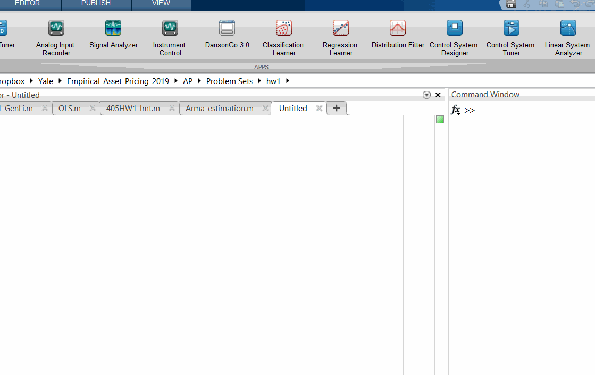

# Event Study Robot (DansonGo 3)

This is an offline event study application equipped with the processed CRSP and French library data. It can automatically perform event study by importing a list of PERMNO, event date, and window size

## Screenshot

## Prerequisites

Matlab R2016b or above version.

## Contributor

- [Gen Li](